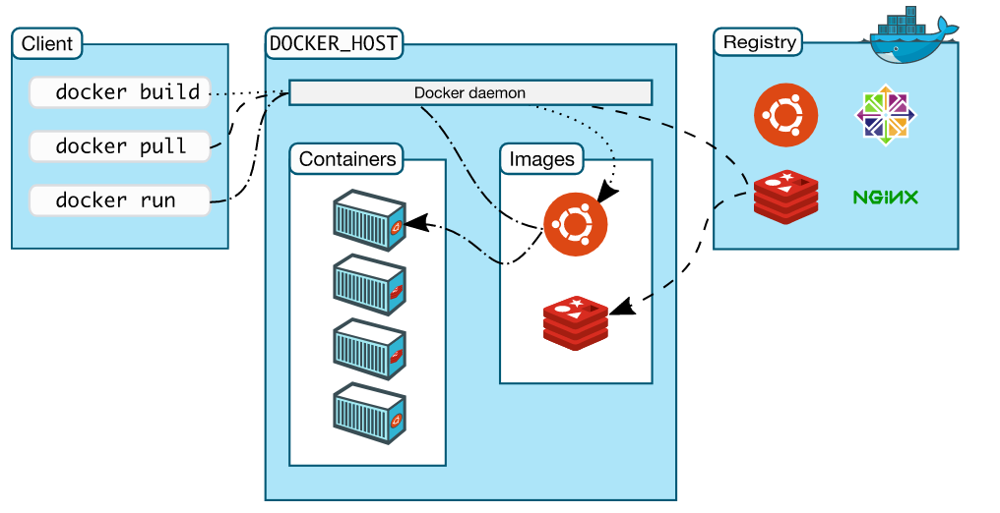
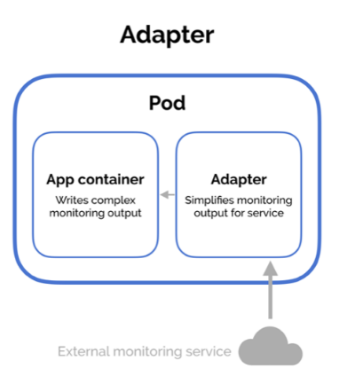

# Application Design and Build

## Domain & Competencies
* Define, build and modify container images
* Understand Jobs and CronJobs
* Understand multi-container Pod design patterns (e.g. sidecar, init and others)
* Utilize persistent and ephemeral volumes


# Define, build and modify container images
Create and build images, create and run containers. Basic commands:

## What is Docker?

Docker is an open source technology for building, deploying, and managing containerized applications. Docker Architecture:

<p align="center">
  
</p>

[Source docs.docker.com](https://docs.docker.com/get-started/overview/)

## Images and Containers

Docker images are templates used to build containers. Containers are application in execution (alive), product of build docker images.  There are three main elements to create containers:


<p align="center">
  
</p>

[Source Nilesh Jayanandana](https://medium.com/platformer-blog/practical-guide-on-writing-a-dockerfile-for-your-application-89376f88b3b5)

## Basic Commands

Images
```bash
# Images
docker images
cat Dockerfile
docker build -t <image-name> .
docker build -t my-app .
docker build -t <image-name>:<image-tag> .
docker build -t my-app:v01 .
```
Containers
```bash
docker run -p <host-port>:<container-port> <image-name>
docker run -p 8080:8585 my-app
docker ps
docker run <image-name> <command>
docker run my-app cat /etc/*release*
docker run <image-name>:<image-tag> -p <host-port>:<container-port>
docker run my-app:v01 -p 8080:8484
```

# Understand Jobs and CronJobs

## What is a Job?

A job creates one or more pods and will continue to retry the pods until it successfully completes the number of pods defined in the Job. A Job needs a Pod definition for its creation.

Let's see this Pod Defination, which purpose is add two numbers.

```yaml
apiVersion: v1
kind: pod
metadata:
  name: calculator
spec:
  containers:
  - name: math-image
    image: ubuntu
    command: ['expr','4', '+', '5']
```

basic-job-template.yaml It is a Job that will take the previous Pod definition and, It will stop when the operation is finished "restartPolicy: Never"

```yaml
apiVersion: batch/v1
kind: Job
metadata:
  name: calculator
spec:             # spec from Job
  completions: 3  # Each Pod created by the Job controller has an identical spec
  parallelism: 3  # Create parallel Pods instead of sequential ones
  template:
    spec:         # spec from Pod 
      containers:
        - name: math-image
          image: ubuntu
          command: ['expr','4', '+', '5']
      restartPolicy: Never
```

Jobs

```bash
kubectl create -f basic-job-template.yaml
kubectl get jobs
kubectl logs <name-of-pod>
kubectl logs calculator-ggznd
kubectl delete job calculator
```
Basic Commands CronJobs

Cron is a time-based job scheduler in Linux and Unix systems. 

<p align="center">
  
</p>

Use [crontab.guru](https://crontab.guru/) to practice cron schedule expressions.

A CronJob creates Job periodically on a given schedule. It takes a Job defination. For example:

basic-cronjob-template.yaml

```yaml
apiVersion: batch/v1
kind: CronJob
metadata:
  name: reporting-cron-calculator
spec:                       # CronJob spec
  schedule: "* * * * *"
  jobTemplate:
    spec:                   # Job spec
      completions: 3 
      parallelism: 3 
      template:
        spec:               # Pod spec
          containers:
            - name: math-image
              image: ubuntu
              command: ['expr','4', '+', '5']
          restartPolicy: Never  
```

Basic Commands CronJobs

```bash
kubectl create -f basic-cronjob-template.yaml
kubectl get cj
kubectl get cronjobs
kubectl get pods
kubectl delete cronjobs reporting-cron-calculator
```

# Multi-Containers

Pods require multiple container for a complete solution, Pods with the same life cicle (created together and distroy together) 
In this Pod example, we have two containers, the first one will read data from the volume, and the second one will write data.

mcp.yaml
```yaml
apiVersion: v1
kind: Pod
metadata:
  name: mcp # Multi-Container Pod
spec:
  restartPolicy: Never
  volumes:
  - name: shared-data
    emptyDir: {}
  containers:
  - name: 1st
    image: nginx
    volumeMounts:
    - name: shared-data
      mountPath: /usr/share/nginx/html
  - name: 2nd
    image: debian
    volumeMounts:
    - name: shared-data
      mountPath: /pod-data
    command: ["/bin/sh"]
    args: ["-c", "echo Hello from the 2nd container > /pod-data/index.html"]
```

```bash
kubectl apply -f mcp.yaml
# read data of the 1st container from 2nd container
kubectl exec mcp -c 1st -- /bin/cat /usr/share/nginx/html/index.html
Hello from the 2nd container
# Logs
kubectl logs mcp -c 1st
kubectl logs mcp -c 2ndu
```
## SideCar
A container works well without a sidecar, but with it, it can perform additional extra functions.A good example is using a sidecar for logging and monitoring.


<p align="center">
  
</p>


SideCar Example: This application will write the current date to the app.txt file every five seconds

sidecar.yaml
```yaml
apiVersion: v1
kind: Pod
metadata:
  name: pod-with-sidecar
spec:
  volumes:
  - name: shared-logs 
    emptyDir: {}
  containers:
  - name: app-container
    image: alpine
    command: ["/bin/sh"]
    args: ["-c", "while true; do date >> /var/log/app.txt; sleep 5;done"]
    volumeMounts:
    - name: shared-logs
      mountPath: /var/log
  - name: sidecar-container
    image: nginx:1.21.6
    ports:
      - containerPort: 80
    volumeMounts:
    - name: shared-logs
      mountPath: /usr/share/nginx/html
```

```bash
# Create the Pod
kubectl apply -f sidecar.yaml
# Connect to the sidecar Pod
kubectl exec pod-with-sidecar -c sidecar-container -it bash
# Install curl
apt-get update && apt-get install curl
# Access to the log of the application via sidecar
curl 'http://localhost:80/app.txt'
```
## Embassador
Use outsource to separate container within the pod to assign a specific data base.

<p align="center">
  
</p>


## Adapter
Processes the logs before sent them to the central server.

<p align="center">
  
</p>

[Sidecar, Adapter and Ambasador examples from Matthew Palmer](https://matthewpalmer.net/kubernetes-app-developer/articles/multi-container-pod-design-patterns.html)

# Utilize persistent and ephemeral volumes
