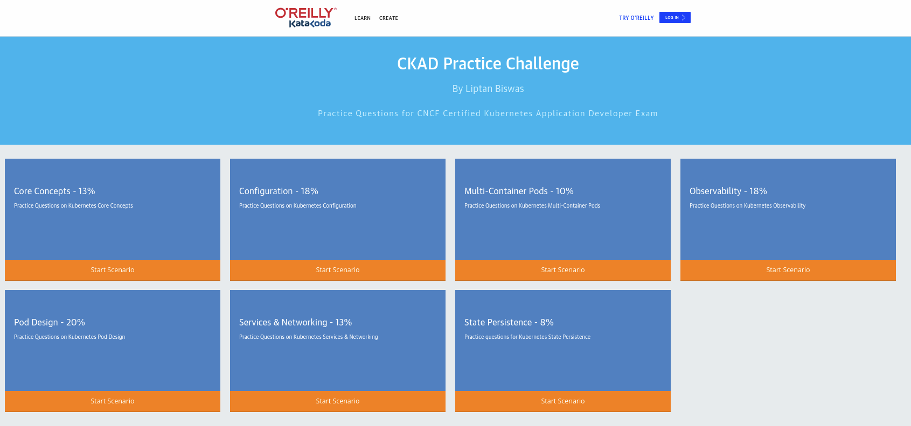

# katacoda - CKAD Practice Challenge

Link to practice [HERE](https://www.katacoda.com/liptanbiswas/courses/ckad-practice-challenges)


<p align="center">
  
</p>


# Exercises

# asdas

## Exercise 03:
Create a service messaging-service to expose the redis deployment in the marketing namespace within on port 6379

**Solution:**
```bash
# Set the context in the current namespace
kubect config set-context --current --namespace=marketing
# Create the service with expose and add the ports
kubectl expose deploy redis messaging-service -n masrketing --port 6379 --targetPort 6379
```

## Exercise 04:
Find the name of pod which is using most CPU across all namespaces. Enter the name of pod in /root/high-cpu.yaml

```bash
kbuectl top po -A --sort-by=cpu
```

### Exercise 05:

Deployment naboo is created. Make sure the replicas autoscale with minimum 2 and maximum 5 when at 80% CPU. Use naboo as the name of HPA resource.

```bash
kubectl autoscale deploy naboo --name=naboo --min=2 --max=5 --cpu-percent=80
```

### Exercise 06:
Create a Cron job bespin that runs every 5 minutes(*/5 * * * *) and runs command date. Use alpine image.

```bash
kubectl create cronjob bespin --image=alpine --schedule="*/5 * * * *" -- date
```

# Configuration - 18%

## Question 01
Create a config map called my-config in namespace called datatab. Use value confa=exvalue You may need to create namespace if it does not exists.

**Solution**
k create cm my-config --from-literal=confa=exvalue -n datatab

## Question 02
A configmap al-conf has been created.

Expose the value of al-user to a pod named al-pod as AL_USER environment variable. Use redis image for the pod.

```yaml
apiVersion: v1
kind: Pod
metadata:
  creationTimestamp: null
  labels:
    run: al-pod
  name: al-pod
spec:
  containers:
  - image: redis
    name: al-pod
    resources: {}
    env:
    - name: AL_USER
      valueFrom:
         configMapKeyRef:
            name: al-conf
            key: al-user
  dnsPolicy: ClusterFirst
  restartPolicy: Always
status: {}
```

## Question 03

Create a Pod named secure-pod. Use redis image. Run pod as user 1000 and group 2000.

**Solution**

```yaml
apiVersion: v1
kind: Pod
metadata:
  creationTimestamp: null
  labels:
    run: secure-pod
  name: secure-pod
spec:
  securityContext:
    runAsUser: 1000
    runAsGroup: 2000
  containers:
  - image: redis
    name: secure-pod
    resources: {}
  dnsPolicy: ClusterFirst
  restartPolicy: Always
status: {}
controlplane $ 
```

## Question 04

Create a pod manifest file at /root/limited-pod.yaml with name limited-pod and busybox image. Set memory request at 100Mi and limit at 200Mi. You do not need to create the pod.

**Solution**

```yaml
apiVersion: v1
kind: Pod
metadata:
  creationTimestamp: null
  labels:
    run: limited-pod
  name: limited-pod
spec:
  containers:
  - image: busybox
    name: limited-pod
    resources:
      limits:
        memory: 200Mi
      requests:
        memory: 100Mi
  dnsPolicy: ClusterFirst
  restartPolicy: Always
status: {}
```

## Question 05

Create a secret db-secret with value MYSQL_ROOT_PASSWORD=YoYoSecret and MYSQL_PASSWORD=XoXoPassword.

Create a configmap db-config with value MYSQL_USER=k8s and MYSQL_DATABASE=newdb.

Create a pod named mydb with image mysql:5.7 and expose all values of db-secret and db-config as environment variable to pod.

**Solution**

k create secret generic  db-secret --from-literal=MYSQL_ROOT_PASSWORD=YoYoSecret --from-literal=MYSQL_PASSWORD=XoXoPassword 

k create cm db-config --from-literal=MYSQL_USER=k8s --from-literal=MYSQL_DATABASE=newdb

k run mydb --image=mysql:5.7 --restart=Never --fry-run=client -o yaml > pod3.yaml

```yaml
apiVersion: v1
kind: Pod
metadata:
  creationTimestamp: null
  labels:
    run: mydb
  name: mydb
spec:
  containers:
  - image: mysql:5.7
    name: mydb
    resources: {}
    envFrom:
    - configMapRef:
          name: db-config
    - secretRef:
          name: db-secret
  dnsPolicy: ClusterFirst
  restartPolicy: Never
status: {}
```

# Multi Container Pods - 10%

## Question 01

Create a pod mp-hello with image alpine,nginx and consul:1.8. Use command sleep infinity for alpine container.

**Solution**

```yaml
apiVersion: v1
kind: Pod
metadata:
  creationTimestamp: null
  labels:
    run: mp-hello
  name: mp-hello
spec:
  containers:
  - image: alpine
    name: alpine
    args:
      - sleep 
      - infinity
  - image: nginx
    name: nginx 
  - image: consul:1.8
    name: consult
    resources: {}
  dnsPolicy: ClusterFirst
  restartPolicy: Always
status: {}
```


# Observability - 18%

## Question 01
Create a pod myredis with image redis. Define a liveness probe and readiness probe with an initial delay of 5 seconds and command redis-cli PING

**Solution**

```yaml
apiVersion: v1
kind: Pod
metadata:
  creationTimestamp: null
  labels:
    run: myredis
  name: myredis
spec:
  containers:
  - image: redis
    name: myredis
    resources: {}
    livenessProbe:
      exec:
        command:
        - redis-cli
        - PING
      initialDelaySeconds: 5
    readinessProbe:
      exec:
        command:
        - redis-cli
        - PING
      initialDelaySeconds: 5
  dnsPolicy: ClusterFirst
  restartPolicy: Never
status: {}
```

## Question 01

Create a pod httptest with image kennethreitz/httpbin. Define a readiness probe at path /status/200 on port 80 of the container.

**Solution**

```yaml
kind: Pod
metadata:
  creationTimestamp: null
  labels:
    run: httptest
  name: httptest
spec:
  containers:
  - image: kennethreitz/httpbin
    name: httptest
    resources: {}
    readinessProbe:
      httpGet:
        path: /status/200
        port: 80
  dnsPolicy: ClusterFirst
  restartPolicy: Never
status: {}
```

## Question 01

Create a Pod named myenv with command sh -c "printenv && sleep 1h". Use alpine image.

**Solution**

apiVersion: v1
kind: Pod
metadata:
  creationTimestamp: null
  labels:
    run: myenv
  name: myenv
spec:
  containers:
  - args:
    - sh
    - -c
    - printenv && sleep 1h
    image: alpine
    name: myenv
    resources: {}
  dnsPolicy: ClusterFirst
  restartPolicy: Never
status: {}

## Question 01

Find the name of pod which is using most CPU across all namespaces. Enter the name of pod in /root/high-cpu.yaml.

**Solution**
```
kubectl top po -A --sort-by=cpu
```

# Pod Design - 20%

## Question 01
Create a deployment named hoth with image httpd in planets namespace.
Scale the deployment to 4 replicas.
Update the deployment to use httpd:2.4.46 image.

**Solution**
k create nd planets
k create deploy hoth --image=httpd -n planets
k create deploy hoth --image=httpd  -n planets
k scale deploy hoth --replicas=4 -n planets

## Question 02

Deployment yavin is deployed but after an upgrade, new pods are not getting created. Rollback the deployment yavin so they are working again.

Export yavin deployment spec in JSON to /root/yavin.json file.

**Solution**
k rollout undo deploy yavin
k get deploy yavin -o json > /root/yavin.json

## Question 03

Deployment naboo is created. Make sure the replicas autoscale with minimum 2 and maximum 5 when at 80% CPU. Use naboo as the name of HPA resource.

**Solution**
k autoscale deploy naboo --min=2 --max=5 --cpu-percent=80


## Question 04
Get the name and image of all pods in skywalker namespace having label jedi=true. Write the output to /root/jedi-true.txt

Output should be in the following format. Use jsonpath.

podname,image
podname2,image

**Solution**
kubectl get po  -n skywalker --selector=jedi=true -o jsonpath="{range .items[*]}{.metadata.name},{.spec.containers[0].image}{'\n'}{end}" > /root/jedi-true.txt


# Services & Networking - 13%

## Question 01
Create a pod named ig-11 with image nginx and expose its port 80.

**Solution**

```bash
k run ig-11  --restart=Never --image=nginx --port=80
```

## Quesion 02
Create a service for pod ig-11 on using ClusterIP type service with service name greef. Map service port 8080 to container port 80.

**Solution**

```bash
k expose pod ig-11 --name=greef --port=8080 --target-port=80
```

## Quesion 03

Deployment cara is created. Expose port 80 of the deployment using NodePort on port 31888. Use cara as service name.

**Solution**

```bash
k expose deployment cara --port=80 --type=NodePort

#  k edit service cara
# then change nodePort to 31888
```

## Question 4
Pod and Service geonosis is created for you. Create a network policy geonosis-shield which allows only pods with label empire=true to access the service. Use appropriate labels.

**Solution**

```bash
vim np.yaml
```
```yaml
apiVersion: networking.k8s.io/v1
kind: NetworkPolicy
metadata:
  name: geonosis-shield
  namespace: default
spec:
  podSelector:
    matchLabels:
      sector: arkanis # Take the labels of the service and of the pod
  policyTypes:
  - Ingress
  ingress:
  - from:
    - podSelector:
        matchLabels:
          empire: "true"
```

# State Persistence - 8%

## Question 01

Create a pod named "tato" with image nginx. Mount a volume named tato-vol at /var/www/html, which should live as long as pod lives.

**Solution**
```bash
alias kdr='kubectl run --dry-run -o 
yaml'
kdr tato --image=nginx > pod.yaml
```
vim pod.yaml
```yaml
kind: Pod
metadata:
  creationTimestamp: null
  labels:
    run: tato
  name: tato
spec:
  containers:
  - image: nginx
    name: nginx
    resources: {}
    volumeMounts:
    - mountPath: /var/www/html
      name: tato-vol
  volumes:
  - name: tato-vol
    emptyDir: {}
  dnsPolicy: ClusterFirst
  restartPolicy: Always
status: {}
```

## Question 02

Create a persistent volume "first-pv" with 100Mi at /data/mysql on host. Use manual storageClassName and ReadWriteMany access mode.

Create a persistent volume claim "first-pvc" and consume the pv first-pv.

Create a pod "magic" with image mysql and mount the PVC at /var/lib/mysql using volume name first-vol. Set an environment variable MYSQL_ROOT_PASSWORD=my-secret-pw as well.

**Solution**

vim pv.yaml
```yaml
apiVersion: v1
kind: PersistentVolume
metadata:
  name: first-pv
spec:
  capacity:
    storage: 100Mi
  volumeMode: Filesystem
  accessModes:
    - ReadWriteMany
  persistentVolumeReclaimPolicy: Recycle
  storageClassName: manual
  hostPath:
    path: /data/mysql
```
vim pvc.yaml
```yaml
kind: PersistentVolumeClaim
metadata:
  name: first-pvc
spec:
  accessModes:
    - ReadWriteMany
  volumeMode: Filesystem
  resources:
    requests:
      storage: 100Mi
  storageClassName: manual
```
kubectl run magic --image=mysql > pod.yaml
```yaml
apiVersion: v1
kind: Pod
metadata:
  creationTimestamp: null
  labels:
    run: magic
  name: magic
spec:
  containers:
  - image: mysql
    name: mysql
    env:
    - name: MYSQL_ROOT_PASSWORD
      value: "my-secret-pw"
    resources: {}
    volumeMounts:
      - mountPath: "/var/lib/mysql"
        name: first-vol
  volumes:
    - name: first-vol
      persistentVolumeClaim:
        claimName: first-pvc
  dnsPolicy: ClusterFirst
  restartPolicy: Always
status: {}
```


## Question 03
Create a pod "moodo" with two containers using image nginx and redis. Create a shared hostPath volume at /data/moodo named moodo-logs mounted at /var/log/moodo in both the containers.

**Solution**

vim pod.yaml
```yaml
apiVersion: v1
kind: Pod
metadata:
  creationTimestamp: null
  labels:
    run: moodo
  name: moodo
spec:
  containers:
  - image: nginx
    name: nginx
    volumeMounts:
    - mountPath: /var/log/moodo
      name: moodo-logs
  - image: redis
    name: redis
    volumeMounts:
    - mountPath: /var/log/moodo
      name: moodo-logs
  dnsPolicy: ClusterFirst
  restartPolicy: Always
  volumes:
  - name: moodo-logs
    hostPath:
      path: /data/moodo
status: {}
```