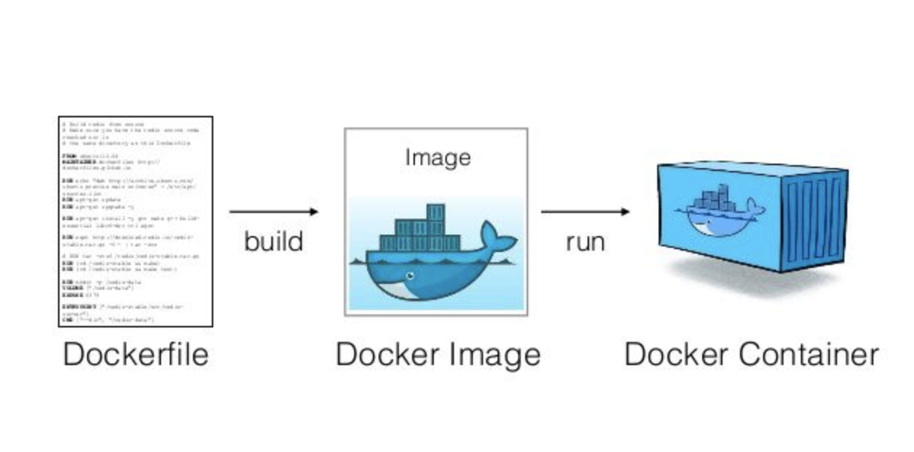
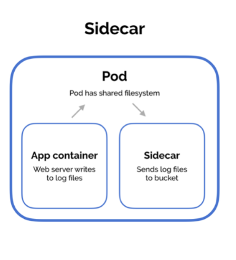
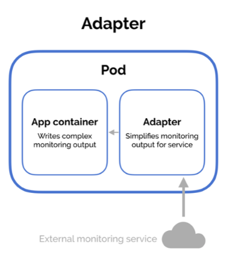
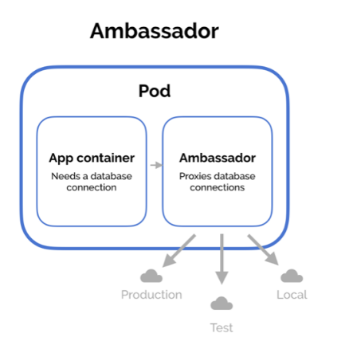

# Application Design and Build

## Domains & Competencies

- Define, build and modify container images
- Understand Jobs and CronJobs
- Understand multi-container Pod design patterns (e.g. sidecar, init and others)
- Utilize persistent and ephemeral volumes

## Define, build and modify container images

Create and build images, create and run containers.

### What is Docker?

Docker is an open source technology for building, deploying, and managing containerized applications. [Docker](https://www.docker.com/) Architecture:

<p align="center">
  
</p>

Learn more about Docker

- [Source docs.docker.com](https://docs.docker.com/get-started/overview/)
- [Docker in 05 minutes](https://www.youtube.com/watch?v=cxCG0cFgsd4&t=151s)

### Images and Containers

Docker images are templates used to build containers. Containers are application in execution (alive), product of build docker images. There are three main elements to create containers:

<p align="center">
  
</p>

[Source Nilesh Jayanandana](https://medium.com/platformer-blog/practical-guide-on-writing-a-dockerfile-for-your-application-89376f88b3b5)

### Basic Commands

Images

```bash
# Images
docker images
cat Dockerfile
docker build -t <image-name> .
docker build -t my-app .
docker build -t <image-name>:<image-tag> .
docker build -t my-app:v01 .
```

Containers

```bash
docker run -p <host-port>:<container-port> <image-name>
docker run -p 8080:8585 my-app
docker ps
docker run <image-name> <command>
docker run my-app cat /etc/*release*
docker run <image-name>:<image-tag> -p <host-port>:<container-port>
docker run my-app:v01 -p 8080:8484
```

## Understand Jobs and CronJobs

### What is a Job?

A job creates one or more pods and will continue to retry the pods until it successfully completes the number of pods defined in the Job. A Job needs a Pod definition for its creation.

Let's see this Pod Definition, which purpose is to add two numbers.

```yaml
apiVersion: v1
kind: pod
metadata:
  name: calculator
spec:
  containers:
    - name: math-image
      image: ubuntu
      command: ["expr", "4", "+", "5"]
```

basic-job-template.yaml It is a Job that will take the previous Pod definition and, It will stop when the operation is finished "restartPolicy: Never"

```yaml
apiVersion: batch/v1
kind: Job
metadata:
  name: calculator
spec: # spec from Job
  completions: 3 # Each Pod created by the Job controller has an identical spec
  parallelism: 3 # Create parallel Pods instead of sequential ones
  template:
    spec: # spec from Pod
      containers:
        - name: math-image
          image: ubuntu
          command: ["expr", "4", "+", "5"]
      restartPolicy: Never
```

Jobs Basic Commands

```bash
kubectl create -f basic-job-template.yaml
kubectl get jobs
kubectl logs <name-of-pod>
kubectl delete job calculator
```

### CronJobs

A Cron is a time-based job scheduler in Linux and Unix systems. Use [crontab.guru](https://crontab.guru/) to practice cron schedule expressions.

<p align="center">
  
</p>

A CronJob creates Jobs periodically on a given schedule. It takes a Job definition. For example:

basic-cronjob-template.yaml

```yaml
apiVersion: batch/v1
kind: CronJob
metadata:
  name: reporting-cron-calculator
spec: # CronJob spec
  schedule: "* * * * *"
  jobTemplate:
    spec: # Job spec
      completions: 3
      parallelism: 3
      template:
        spec: # Pod spec
          containers:
            - name: math-image
              image: ubuntu
              command: ["expr", "4", "+", "5"]
          restartPolicy: Never
```

Basic Commands CronJobs

```bash
kubectl create -f basic-cronjob-template.yaml
kubectl get cj
kubectl get cronjobs
kubectl get pods
kubectl delete cronjobs reporting-cron-calculator
```

### Multi-Containers

Pods require multiple containers for a complete solution, Pods with the same life cycle (created together and destroyed together)
In this Pod example, we have two containers, the first one will read data from the volume, and the second one will write data.

mcp.yaml

```yaml
apiVersion: v1
kind: Pod
metadata:
  name: mcp # Multi-Container Pod
spec:
  restartPolicy: Never
  volumes:
    - name: shared-data
      emptyDir: {}
  containers:
    - name: 1st
      image: nginx
      volumeMounts:
        - name: shared-data
          mountPath: /usr/share/nginx/html
    - name: 2nd
      image: debian
      volumeMounts:
        - name: shared-data
          mountPath: /pod-data
      command: ["/bin/sh"]
      args: ["-c", "echo Hello from the 2nd container > /pod-data/index.html"]
```

```bash
kubectl apply -f mcp.yaml
# read data of the 1st container from 2nd container
kubectl exec mcp -c 1st -- /bin/cat /usr/share/nginx/html/index.html
Hello from the 2nd container
# Logs of each container
kubectl logs mcp -c 1st
kubectl logs mcp -c 2nd
```

### SideCar

A container works well without a sidecar, but with it, it can perform additional extra functions. A good example is using a sidecar for logging and monitoring.

<p align="center">
  
</p>

SideCar example: This application will write the current date to the app.txt file every five seconds

sidecar.yaml

```yaml
apiVersion: v1
kind: Pod
metadata:
  name: pod-with-sidecar
spec:
  volumes:
    - name: shared-logs
      emptyDir: {}
  containers:
    - name: app-container
      image: alpine
      command: ["/bin/sh"]
      args: ["-c", "while true; do date >> /var/log/app.txt; sleep 5;done"]
      volumeMounts:
        - name: shared-logs
          mountPath: /var/log
    - name: sidecar-container
      image: nginx:1.21.6
      ports:
        - containerPort: 80
      volumeMounts:
        - name: shared-logs
          mountPath: /usr/share/nginx/html
```

```bash
# Create the Pod
kubectl apply -f sidecar.yaml
# Connect to the sidecar Pod
kubectl exec pod-with-sidecar -c sidecar-container -it bash
# Install curl
apt-get update && apt-get install curl
# Access to the log of the application via sidecar
curl 'http://localhost:80/app.txt'
```

### Adapter

Processes the logs before sent them to the central server. In this example the adapter container reads whay the application has written and reformats it into a structure that a hypothetical monitoring requires.

<p align="center">
  
</p>

Adapter example: This application writes system usage information (`top`) to a status file every five seconds. Teh sidecar container takes this output and simplifies for the monitoring service.

adapter.yaml

```yaml
apiVersion: v1
kind: Pod
metadata:
  name: pod-with-adapter
spec:
  volumes:
    - name: shared-logs
      emptyDir: {}
  containers:
    - name: app-container
      image: alpine
      command: ["/bin/sh"]
      args:
        [
          "-c",
          "while true; do date > /var/log/top.txt && top -n 1 -b >> /var/log/top.txt; sleep 5;done",
        ]
      volumeMounts:
        - name: shared-logs
          mountPath: /var/log
    - name: adapter-container
      image: alpine
      command: ["/bin/sh"]
      args: [
          "-c",
          "while true; do (cat /var/log/top.txt | head -1 > /var/log/status.txt) && (cat /var/log/top.txt | head -2 | tail -1 | grep
          -o -E '\\d+\\w' | head -1 >> /var/log/status.txt) && (cat /var/log/top.txt | head -3 | tail -1 | grep
          -o -E '\\d+%' | head -1 >> /var/log/status.txt); sleep 5; done",
        ]
      volumeMounts:
        - name: shared-logs
          mountPath: /var/log
```

```bash
# Create Pod
kubectl apply -f adapter.yaml
# Connect to adapter container
kubectl exec pod-with-adapter -c app-container -it sh
# Take a look on what the application is writing
cat /var/log/top.txt
# Take a look on what the adapter has reformateted on it.
cat /var/log/status.txt
```

[Sidecar, Adapter and Ambasador examples from Matthew Palmer](https://matthewpalmer.net/kubernetes-app-developer/articles/multi-container-pod-design-patterns.html)

### Embassador

Use outsource to separate container within the pod to assign a specific data base. It is a kind of sidecar container which simplifies accessing services outside the Pod.

<p align="center">
  
</p>

[Kubernetes Patterns : The Ambassador Pattern](https://www.magalix.com/blog/kubernetes-patterns-the-ambassador-pattern) by Mohamed Ahmed

## Utilize persistent and ephemeral volumes

Kubernetes supports many types of volumes. A pod can use Ephemeral volumes which have a lifetime of a pod, and persistent volumes that exist beyond the lifetime of a pod. When a pod finishes, Kubernetes destroys the data of the ephemeral volumes; however, Kubernetes does not destroy persistent volumes. For any kind of volume in a given pod, data is preserved across container restarts.

### Volumes

On-disk files in a container are ephemeral, which presents some problems for non-trivial applications when running in containers.

pod-with-ephemeral-volume.yaml

```yaml
apiVersion: v1
kind: Pod
metadata:
  creationTimestamp: null
  name: alpine
spec:
  containers:
    - image: alpine
      name: alpine
      resources: {}
      command: ["/bin/sh", "-c"]
      args: ["shuf -i 0-10 -n 1 >> /tmp/number.out"]
      volumeMounts:
        - mountPath: /tmp
          name: data-volume
  volumes:
    - name: data-volume
      hostPath:
        path: /tmp
        type: Directory
```

```bash
kubectl apply -f pod-with-ephemeral-volume.yaml
```

### Persistent Volumes

A PersistentVolume (PV) is a piece of storage in the cluster that has been provisioned by an administrator or dynamically provisioned using Storage Classes

host-path.pv

```yaml
apiVersion: v1
kind: PersistentVolume
metadata:
  name: pv-hostpath
  labels:
    type: local
spec:
  capacity:
    storage: 1Gi
  accessModes:
    - ReadWriteOnce
  hostPath: # Single node testing only — local storage is not supported in any way and WILL NOT WORK in a multi-node cluster
    path: "/tmp/kube"
```

aws-elastic-block-store.pv

```yaml
apiVersion: v1
kind: PersistentVolume
metadata:
  name: pv-hostpath
  labels:
    type: local
spec:
  storageClassName: manual
  capacity:
    storage: 1Gi
  awsElasticBlockStore: #  WORKS in a multi-node cluster
    volumeID: <volume-id>
    fsType: ext4
```

```bash
kubectl apply -f host-path.pv
kubectl get pv
```

### Persistent Volumes Claim

Pods use PersistentVolumeClaims (PVC) to request physical storage. An administrator create Persistent Volume and a User create Persisten Volume Claim.

pvc.yaml

```yaml
apiVersion: v1
kind: PersistentVolumeClaim
metadata:
  name: claim-log-1
spec:
  accessModes:
    - ReadWriteOnce
  resources:
    requests:
      storage: 50Mi
```

```bash
kubectl apply -f pvc.yaml
kubectl get pvc
```

### Using a PVC in a Pod

```yaml
apiVersion: v1
kind: Pod
metadata:
  name: mypod
spec:
  containers:
    - name: myfrontend
      image: nginx
      volumeMounts:
        - mountPath: "/var/www/html"
          name: mypd
  volumes:
    - name: mypd
      persistentVolumeClaim:
        claimName: claim-log-1
```
