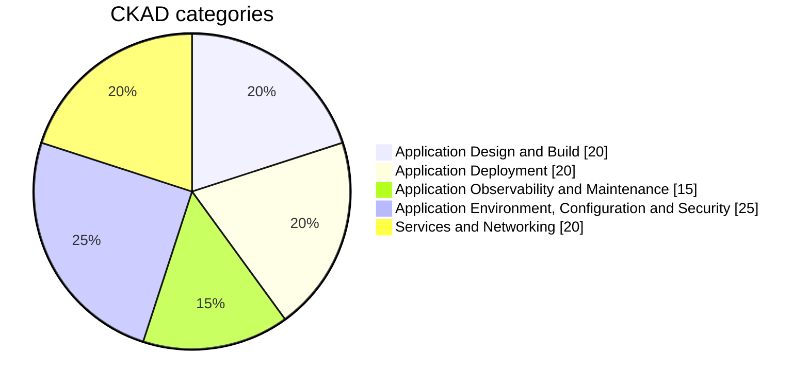

# Certified Kubernetes Application Developer (CKAD) :dolphin:

<p align="center">
  
</p>

This repository contains my notes, definitions, tips, sources, and commands that I used to prepare for the Certified Kubernetes Application Developer exam.

## **About the Certified Kubernetes Application Developer (CKAD)**



## More Details

<details>
  <summary>Application Design and Build (20%)</summary>

- Define, build, and modify container images
- Choose and use the right workload resource (Deployment, DaemonSet, CronJob, etc.)
- Understand multi-container Pod design patterns (e.g., sidecar, init, and others)
- Utilize persistent and ephemeral volumes

</details>

<details>
  <summary>Application Deployment (20%)</summary>

- Use Kubernetes primitives to implement common deployment strategies (e.g., blue/green or canary)
- Understand Deployments and how to perform rolling updates
- Use the Helm package manager to deploy existing packages
- Kustomize

</details>

<details>
  <summary>Application Observability and Maintenance (15%)</summary>

- Understand API deprecations
- Implement probes and health checks
- Use built-in CLI tools to monitor Kubernetes applications
- Utilize container logs
- Debugging in Kubernetes

</details>

<details>
  <summary>Application Environment, Configuration, and Security (25%)</summary>

- Discover and use resources that extend Kubernetes (CRD, Operators)
- Understand authentication, authorization, and admission control
- Understand requests, limits, quotas
- Understand ConfigMaps
- Define resource requirements
- Create & consume Secrets
- Understand ServiceAccounts
- Understand Application Security (SecurityContexts, Capabilities, etc.)

</details>

<details>
  <summary>Services and Networking (20%)</summary>

- Demonstrate basic understanding of NetworkPolicies
- Provide and troubleshoot access to applications via services
- Use Ingress rules to expose applications

</details>

<br></br>
Get more information [Training Linux Fundation](https://www.cncf.io/training/certification/ckad/) Updated September 28, 2021. You can also check the [curriculum](https://github.com/cncf/curriculum/blob/master/CKAD_Curriculum_v1.31.pdf)

## Useful commands

### Shortcuts for Kubernetes Objects

You can use the following shortcuts for common Kubernetes objects:

| Shortcut | Object             | Shortcut    | Object                 |
| -------- | ------------------ | ----------- | ---------------------- |
| `po`     | Pods               | `cm`        | ConfigMaps             |
| `rs`     | ReplicaSets        | `secret`    | Secrets                |
| `deploy` | Deployments        | `ing`       | Ingresses              |
| `svc`    | Services           | `endpoints` | Endpoints              |
| `ns`     | Namespaces         | `netpol`    | Network Policies       |
| `pv`     | Persistent Volumes | `pvc`       | PersistentVolumeClaims |
| `sa`     | Service Accounts   |             |

### Use the right context always

```bash
# List all kubectl contexts configured in the kubeconfig file
kubectl config get-context

# Switch the current context to the specified cluster (replace 'new-context' with your desired context name)
kubectl config set current-context new-context

# Every time before to start the question
kubectl config use-contex <CONTEXTNAME>
```

### **My Setup (Optional) - Use Alias and ShortCuts**

```bash
alias k=kubectl
# Example: k get pods

alias kn='kubectl config set-context --current --namespace'
# Example: kn mynamespace

alias ka='kubectl apply -f'
# Example: ka pod.yaml

alias kr='kubectl replace --force -f'
# Example: kr pod.yaml

alias kd='kubectl delete --force --grace-period=0'
# Example: kd pod pod.yaml

export do='--dry-run=client -o yaml'
# Example: k run my-pod --image=nginx $do > pod.yaml
```

### Kubectl Contexts

```bash
# List all kubectl contexts configured in the kubeconfig file
kubectl config get-context

# Switch the current context to the specified cluster (replace 'new-context' with your desired context name)
kubectl config set current-context new-context
```

[CheatSheet](https://www.canva.com/design/DAGZQwvtXgw/BHlmNbYFx9Tu0R7RQV6lGQ/edit) -> UPDATE Made by Edith Puclla

# **Tips** :gift:

- Attempt all questions - don’t get stuck on any single one.
- Get comfortable with YAML.
- Use shortcuts and aliases to save time.
- Refer to Kubernetes documentation for most of what you need (And practice using it).
- Practice using imperative commands as much as possible [Kubectl Gettign Started](https://kubernetes.io/docs/reference/generated/kubectl/kubectl-commands#-strong-getting-started-strong-).
- Use the `kubectl explain` command to understand resources better.
- Manage your time effectively.
- Improve your speed and proficiency with VIM.
- If studying alone feels unmotivating, find a study buddy who is also preparing for the exam.
- Divide your study time equally between learning concepts and hands-on practice.
- Consider using AI to help study and practice for the exam. While some may disagree, I found it incredibly helpful for clarifying simple concepts.

## Vim Setup

Understand what these commands do and how to use it in Vim:
Open `vim ~/.vimrc`

```sh
set expandtab # This tells Vim to convert tabs into spaces.
set tabstop=2 # This sets the width of a tab character to 2 spaces.
set shiftwidth=2 # This controls the number of spaces used for auto-indentation when using commands like >> (indent) or << (outdent) in Vim.
```

## YAML file navigation in Vim

```bash
# Move the cursor left, down, up or right
- Use:
    h -> move to lef
    l -> move to right
    j -> move down
    k -> move  up
# Edit/view/find words or lines
- Esc + w           -> move word to word, set cursor at the beginning of the word
- Esc + b           -> move word to word, set cursor at the start of the previous word
- Esc + $           -> move to the end of the line
- Esc + 0           -> move to the beginning of the line
- Esc + e           -> move word to word, set cursor at the end of the word
- Esc + dw          -> Delete a word, set cursor at the beginning of the word, then a, to start typing
- Esc + /           -> Find a word

# Move cursos in the file
- Esc + gg          -> move to the beginning of the file
- Esc + G           -> move to the end of the file
- Ctrl-u: Scroll up half a page.
- Ctrl-d: Scroll down half a page.

#  Edit/view/find lines
- Esc + DD          -> delete a line
- Esc + o           -> add a new line
- Esc + :set nu     -> to add line numbers
- Esc :num + Enter  -> go a specific number  line in a file, example: Esc :22
- Esc + u           -> revert changes

# Indent several lines
- Shift + v         -> to visual mode and up and down arrows to move the cursor
- Shift + >         -> indentation to the right
- Shift + <         -> indentation to the left
- Shift + 2>         -> indentation to the right, two times
- Shift + 3<         -> indentation to the left, three times

# Copy and paste single line
- Esc + y           -> copy a line
- Esc + p           -> paste the line
- Esc + d           -> cut the line

# Copy and paste several lines
- Esc + v           -> Mark lines, then arrow keys to select several lines
- Esc + y           -> Copy marked lines
- Esc + p           -> Past lines

# Vim Shortcuts

| Command | Action                                                | Scope                                             |
| ------- | ----------------------------------------------------- | ------------------------------------------------- |
| `cc`    | Delete the current line and enter insert mode         | Entire line                                       |
| `dd`    | Delete the current line                               | Entire line                                       |
| `diw`   | Delete the word under the cursor (no spaces)          | Word only                                         |
| `viw`   | Visually select the word under the cursor (no spaces) | Word only                                         |
| `dip`   | Delete the paragraph under the cursor                 | Paragraph (text + surrounding blank lines)        |
| `vip`   | Visually select the inner paragraph                   | Paragraph (text only, no surrounding blank lines) |

```

### [Terminal] Move the Cursor in the terminal

```bash
CTRL + A # Move to the beginning of the line
CTRL + E # Move to the end of the line
Press left or right arrow keys + keep pressing CTRL # Move one word to the left or right with speed (I use this a lot)
```

🚦 get more commands here: [See more details in the other README](./more-commands.md)

## Resources :bell: :bell:

### Kubernetes Documentation :blue_book:

- [Kubernetes documentation](https://kubernetes.io/docs/tasks/tools/install-kubectl-linux/) - bookmarks have to be based in the oficial documentation
- [Kubectl Getting Started ](https://kubernetes.io/docs/reference/generated/kubectl/kubectl-commands#-strong-getting-started-strong-)

### Course :radio:

- [Udemy CKAD preparation](https://www.udemy.com/course/certified-kubernetes-application-developer/?start=0#overview) -> Mumshad Mannambeth

### Practice :pencil2:

- [Kodecloud Kubernetes Challenge](https://learn.kodekloud.com/courses/kubernetes-challenges) A set of fun challenges to learn and practice your skills on Kubernetes
- [KillerCoda - Killer Shell CKAD](https://killercoda.com/killer-shell-ckad)
- [Kubernetes CKAD Weekly Challenge](https://lnkd.in/eZ6-Jtst) by Kim Wuestkamp
- [Kubernetes CKAD Example Exam Questions Practical Challenge Series 2019](https://codeburst.io/kubernetes-ckad-weekly-challenges-overview-and-tips-7282b36a2681) by Kim Wuestkamp
- [Certified Kubernetes Application Developer Simulator](https://killer.sh/ckad) , it is free to use if you are registered in the Linux Foundation CKAD exam
- [Practice Enough With These 150 Questions for the CKAD Exam 2019](https://medium.com/bb-tutorials-and-thoughts/practice-enough-with-these-questions-for-the-ckad-exam-2f42d1228552) by Bhargav Bachina
- [Github CKAD Exercises dgkanatsios](https://github.com/dgkanatsios/CKAD-exercises)
- [Kubernetes Network Policy Recipes](https://github.com/ahmetb/kubernetes-network-policy-recipes) by Ahmet Alp Balkan
- [Tutorial helps you get started with Kubernetes NetworkPolicy](https://networkpolicy.io/) by Kubernetes and Cilium
- [CKAD Resources by lucassha](https://github.com/lucassha/CKAD-resources)
- [CKAD Exam Guide](https://blog.kubesimplify.com/ckad-exam-april-2022) by Navneet Nandan Jha

### Videos :movie_camera:

- [How to Pass CKA, CKAD with Flying Colors?](https://www.youtube.com/watch?v=TJSAcwUP0pE) by I AM DINUTH, 03 year ago but still very useful
- [How to CRUSH the CKAD Exam!](https://www.youtube.com/watch?v=5cgpFWVD8ds) by Alta3 Research. Not updated but some useful tips and tricks that still valid for the exam
- [Higher Level Editing with Vim Text Objects](https://www.youtube.com/watch?v=Tk_vqJA4gK4) by matt-savvy

### Other Resources

Other resources that I did not use but are also recommended:

- [Kubernetes Introduction - Docker, Kubernetes + Hands On Labs](https://www.udemy.com/user/james-spurin/?srsltid=AfmBOoor4vPLpvU2wKbBFVg0a6r3sGf-EImUsLKsry-hyhhGpf1Y6syB) by James Spurin
- [Kubernetes for Developers: Core Concepts](https://www.pluralsight.com/courses/kubernetes-developers-core-concepts) by Nigel Poulton
- [Containers Courses](https://labs.iximiuz.com/courses?category=containers) by labs.iximiuz.com

### AI

Use AI to help you to study and practice for the exam

- [ChatGPT](https://chatgpt.com/) by OpenAI
- [Microsoft Copilot](https://copilot.microsoft.com/)
- others of your preference

> Note: Use it to understand to support your study and expand your knowledge. Take as a main source the official documentation of Kuberentes!

Get ready to get certified! You got this!! 🤗 🚀


