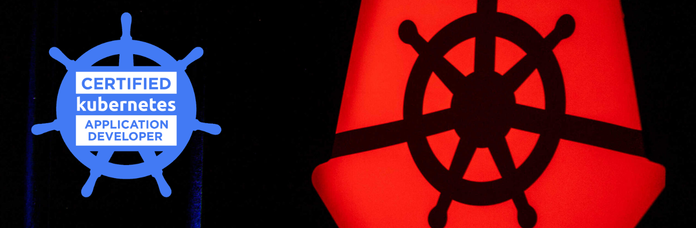
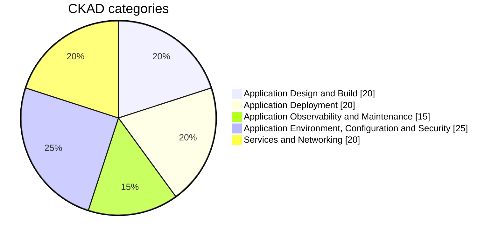
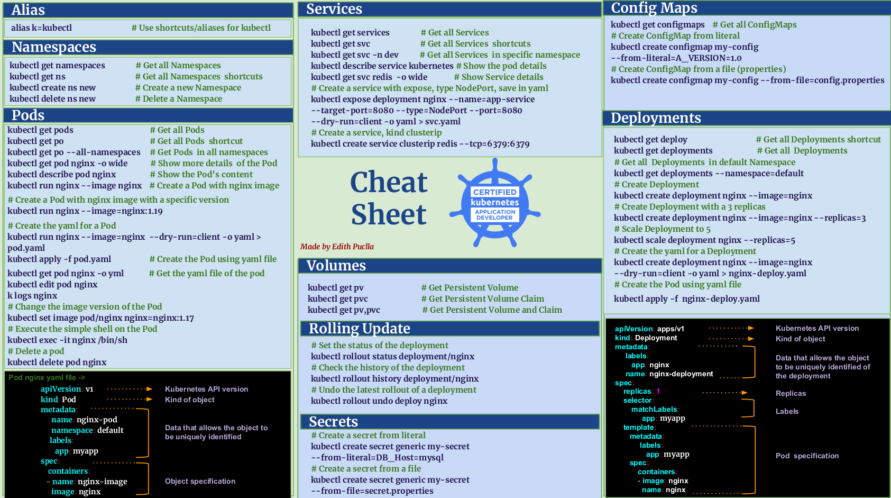
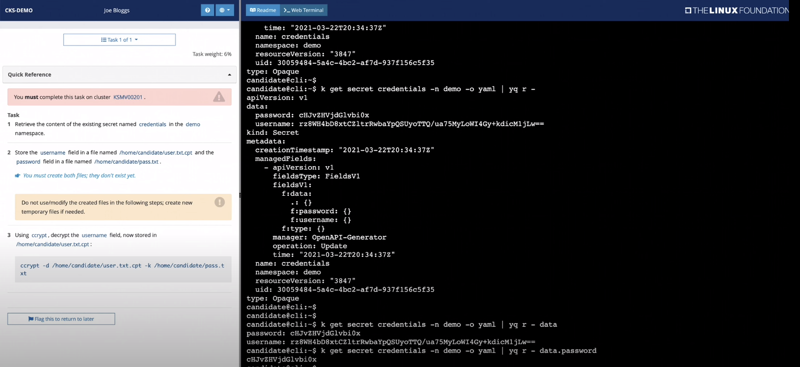

# Certified Kubernetes Application Developer (CKAD) :dolphin:

<p align="center">
  
</p>

This repository contains my notes, definitions, tips, sources, and commands that I used to prepare for the Certified Kubernetes Application Developer exam.

# `REPOSITORY IN PROGRESS ...` :carousel_horse: :raising_hand: :tractor:

## **About the Certified Kubernetes Application Developer (CKAD)**



More information [Training Linux Fundation](https://www.cncf.io/training/certification/ckad/) Updated September 28, 2021. You can also check the [curriculum](https://github.com/cncf/curriculum/blob/master/CKAD_Curriculum_v1.29.pdf)

## Explore each category

Here there is a summary of each category!

- :paw_prints: [Application Design and Build](Categories/application-design-and-build.md)
- :paw_prints: [Application Deployment](Categories/Application-Deployment.md)
- :paw_prints: [Application Observability and Maintenance](Categories/Application-Observability-and-Maintenance.md)
- :paw_prints: [Application Environment, Configuration and Security](Categories/Application-Environment-Configuration-and-Security.md)
- :paw_prints: [Services and Networking](Categories/Services-and-Networking.md)

## Useful commands

# **Use the right context always**

```bash
# List current contexts
kubectl config get-contexts

# Every time before to start the question
kubectl config use-contex <CONTEXTNAME>

# Note: The asterisk represents the current context
```

# **Use Alias**

```bash
# Alias for kubectl
alias k='kubectl'

# This way you can just run k run my-pod --image=nginx $do.
export do="--dry-run=client -o yaml" # Use it: k run ed --image=nginx $do >pod.yaml

# To apply -f
alias ka='kubectl apply -f'
ka pod1.yaml

# Delete a pod with grace period
alias kdp='kubectl delete pod --force'

# kubectl set context
alias kns='config set-context --current --namespace'
```

# **Use Completions**

```bash
source <(kubectl completion bash) # setup autocomplete in bash into the current shell, bash-completion package should be installed first.
echo "source <(kubectl completion bash)" >> ~/.bashrc # add autocomplete permanently to your bash shell.

alias k=kubectl
complete -F __start_kubectl k
```

# **Basic commands**

```bash
# To get all the resorces in a namespaces
kubectl get all

# Describe a resource
kubectl describe pod yellow

# Generate a preview without a file
kubectl create namespace test-123 --dry-run=client -o yaml

# "edit" to edit existing resources
kubectl edit pod nginx
kubectl edit deployment app

# "set" to update a version in a pod or deployment
kubectl set image pod/nginx nginx=nginx:latest
kubectl set image pod/nginx nginx=nginx:1.9.1
kubectl set image deployment/nginx nginx=nginx:latest
kubectl set image deployment/nginx nginx=nginx:1.9.1
```

**Log and Debugging**

```bash
k run --image=busybox bbox -- sh -c 'while true; do date; sleep 3; done '

kubectl logs busybox
# Follow the logs
kubectl logs busybox -f
kubectl logs webapp-1 | grep USER5

# to select the containers
kubectl logs webapp-2 -c
kubectl logs webapp-2 -c simple-webapp
kubectl logs alta3pod | sudo tee ~/opt/answers/mypod.log

# See the error of a pod
kubectl get events | grep -i error
kubectl dev-pod -c log-x | grep WARN > /opt/logs.txt

# To keep watching the logs
kubectl  logs bbox --follow

# Use describe
kubectl describe bbox
kubectl describe mydeploy

# See the event for all the resources
kubectl get events

# Using grep
kubectl get events | grep Schedule

# View control exec
kubectl run --image=busybox bbox -- sh -c 'echo here; sleep 3600'

# Access to the shell inside the pod
kubectl exec -it bbox -- sh
ls
exit

# Check all the deployments in all the namespaces
k get get deploy --all-namespaces

# List pods and services in a single namespace
kubectl -n elastic-stack get pod, svc

# To check for more options
kubectl explain pods --recursive | less
/volumeMounts

# Monitorins
kubectl top node
kubectl top pod
```

**Observability**

```bash
# Collect failed pods by namespace
kubectl -n qa get events | grep -i 'Liveness probe failed'

#  Check pods in all namespaces with READY = 0
k get pod --all-namespaces | grep -i 0

#  Check Liveness and Readiness status
kubectl describe pod nginx | grep -i liveness
kubectl describe pod nginx | grep -i readiness

# You'll see the error here as well
kubectl get events | grep -i error

# kubectl cp command
kubectl cp busybox:etc/passwd ./passwd
```

# Cheat Sheet

<p align="center">
  
</p>

[Download in PDF](https://docs.google.com/presentation/d/1kr8hwqbqQSUE8LVNGxYXF7cHShDIOEeyWRcXHFDYOgo/edit?usp=sharing) -> Made by Edith Puclla

# **Tips and Tricks** :gift:

**From Udemy course with Mumshad Mannambeth**

- Attempt all questions
- Don't get stuck on any question
- Get good with YAML
- Use shortcuts/aliases
  - po for Pods
  - rs for RepicaSets
  - deploy for Deployments
  - svc for Services
  - ns for Namespaces
  - netpol for Networking polices
  - pv for Persistent Volumes
  - pvc for PersistentVolumeClaims
  - sa for service accounts

**From - Muralidaran shanmugham**

- Go through the k8s.io documentation
- Understand all the concepts outlined in the exam curriculum
- Register for courses like Kodekloud
- Time management
  - nano Editor
  - Kubectl alias
  - learn shortcuts
  - alias k='kubectl'
  - k config set-context <cluster name> --namespace=<namespace name>
  - k explain cronjob.spec.jobTemplate --recursive
  - know all the commands => [HERE](https://kubernetes.io/docs/reference/generated/kubectl/kubectl-commands#-strong-getting-started-strong-)
  - --restart (YAML generator)
  - args: ["-c", "while true; do date >> /var/log/app.txt; sleep 5; done"]
  - args: [/bin/sh, -c, 'i=0; while true; do echo "$i: $(date)"; i=$((i+1)); sleep 1; done']
  - args: ["-c", "mkdir -p collect; while true; do cat /var/data/*> /collect/data.txt; sleep 10; done"]
  - Use of grep:
    - kubectl describe pods | grep --context=10 annotations:
    - kubectl describe pods | grep --context=10 Events:

# **Be Fast with VIM**

## Vim Setup

```bash
# Open vim
vim ~/.vimrc

# Add these lines
set expandtab     # Use spaces for tab
set tabstop=2     # Amount of spaces used for tab
set shiftwidth=2  # Amount of spaces used during indentation

```

## Tips

```bash
# Move the cursor
- Use:
    h -> move to left
    l -> move to right
    j -> move down
    k -> move  up
- Esc + w           -> move word to word, set cursor at the beginning of the word
- Esc + e           -> move word to word, set cursor at the end of the word
# Edit/view/find words or lines
- Esc + DD          -> delete a line
- Esc + o           -> add a new line
- Esc + :set nu     -> to add line numbers
- Esc + dw          -> Delete a word
- Esc + u           -> revert changes
- Esc + /           -> Find a word
* Esc :num + Enter  -> go a specific number  line in a file, example: Esc :22
# Indent several lines
- Shift + v         -> to visual mode and up and down arrows to move the cursor
- Shift + >         -> indentation to the right
- Shift + <         -> indentation to the left
# Copy and paste single line
- Esc + y           -> copy a line
- Esc + p           -> paste the line
# copy and paste several lines
- Esc + V           -> Mark lines, then arrow keys to select several lines
- Esc + y           -> Copy marked lines
- Esc + d           -> Cut marked lines
- Esc + p           -> Past lines
```

# Kubectl Contexts

```bash
# List all kubectl context
kubectl config get-context

# Change to cluster
kubectl config set current-context new-context
```

# **Bookmarks on Chrome** :bookmark:

- Go to the documentation: https://kubernetes.io/docs/home/
- Select a topic
- Go to specific section of the page
- Set a bookmark
- If you need copy the code, use copy application to clipboard

# **My Setup (Optional)**

```bash
# Kubectl Autocomplete
# Bash
source <(kubectl completion bash) # setup autocomplete in bash into the current shell, bash-completion package should be installed first.
echo "source <(kubectl completion bash)" >> ~/.bashrc # add autocomplete permanently to your bash shell.

alias k=kubectl
complete -F __start_kubectl k

alias kn='kubectl config set-context --current --namespace '
alias kd='kubectl delete pod --grace-period=0 --force'
alias ka='kubectl apply -f'
export do='--dry-run=client -o yaml'
```

# **Resources:** :bell: :bell:

## **Course** :radio:

- [Udemy CKAD preparation](https://www.udemy.com/course/certified-kubernetes-application-developer/?start=0#overview) -> Mumshad Mannambeth

## **Kubernetes Documentation** :blue_book:

- [Kubernetes documentation](https://kubernetes.io/docs/tasks/tools/install-kubectl-linux/) - bookmarks have to be based in the oficial documentation

## **Practice** :pencil2:

1. [How to Prepare for CKAD and CKA Certification?](https://www.infracloud.io/blogs/prepare-cka-ckad-certification/) -> InfraCloud Team
2. [Game of Pods](https://kodekloud.com/p/game-of-pods-game) A set of fun challenges to learn and practice your skills on Kubernetes
3. [Kubernetes CKAD Example Exam Questions Practical Challenge Series](https://codeburst.io/kubernetes-ckad-weekly-challenges-overview-and-tips-7282b36a2681) -> Kim Wuestkamp
4. [Practice Enough With These 150 Questions for the CKAD Exam](https://medium.com/bb-tutorials-and-thoughts/practice-enough-with-these-questions-for-the-ckad-exam-2f42d1228552) -> Bhargav Bachina
5. [CKAD Exercises](https://github.com/dgkanatsios/CKAD-exercises) Github -> dgkanatsios
6. [Kubernetes Network Policy Recipes](https://github.com/ahmetb/kubernetes-network-policy-recipes)
7. [KillerCoda - Killer Shell CKAD](https://killercoda.com/killer-shell-ckad)

8. [Securing Kubernetes Cluster Networking](https://ahmet.im/blog/kubernetes-network-policy/)
9. https://editor.cilium.io/?id=7OubH15V2XjXYXHr

## **Videos** :movie_camera:

1. [How to Pass CKA, CKAD with Flying Colors?](https://www.youtube.com/watch?v=TJSAcwUP0pE) -> I AM DINUTH
2. [How to CRUSH the CKAD Exam!](https://www.youtube.com/watch?v=5cgpFWVD8ds) -> Alta3 Research, Inc.
3. [Vim Crash Course | How to edit files quickly in CKAD / CKA exam](https://www.youtube.com/watch?v=knyJt8d6C_8) -> The FrontOps Guy

4. Linux Foundation Kubernetes Certifications Now Include Exam Simulator -> killer.sh
   [CKA, CKAD, or CKS simulator](https://training.linuxfoundation.org/announcements/linux-foundation-kubernetes-certifications-now-include-exam-simulator/?utm_source=lftraining&utm_medium=twitter&utm_campaign=k8simulator)

<p align="center">
  
</p>
